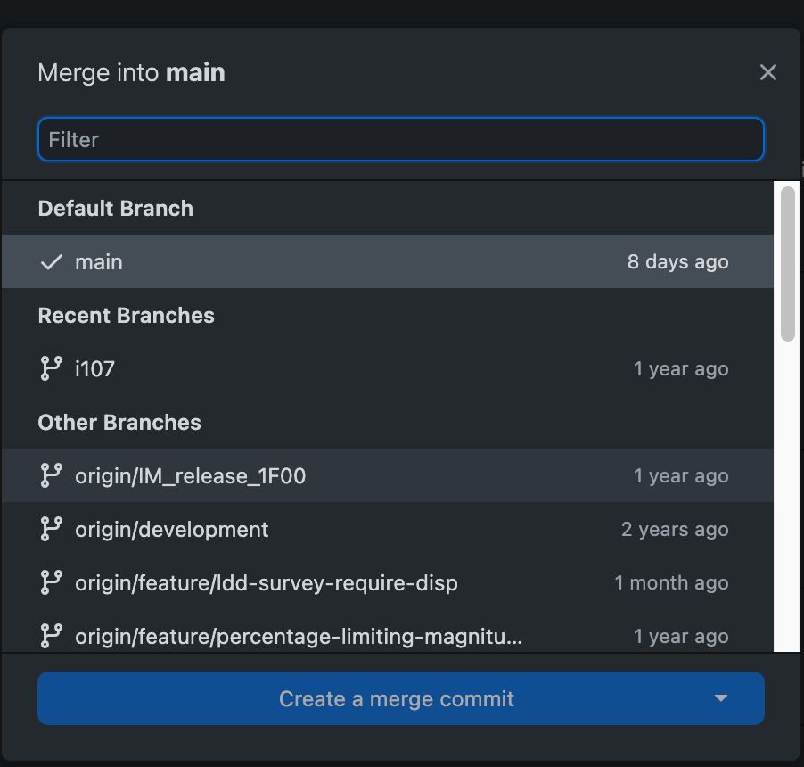

# GitHub Basics

## What is version control?

Version control is a system that will allow to save multiple versions of a document transparently. This means that you do not have to resort to keeping multiple versions of a file with different names manually. The version control system does this for you. It also remembers when each version of a document was created, allowing you to track changes over time.

## What is distributed version control?

Distributed version control is an improvement to version control that allows multiple users to collaborate on a project, and share their changes with each other more easily. In most distributed version control systems, each person keeps a complete history of the changes to a project, allowing them to work independently.

Git is one of the most populat distributed version control systems.

## What is GitHub?

GitHub is a hosting service for git repositories. In addition to creating a central repository for users to coordinate work on their projects, it also provides a simpler, web-based interface into git. It is also has many other features that make life easier for programmers (release distribution, issue tracking, websites, etc). 

## Essential Concept: Repositories (repos)

A git repo is a complete history of a project. This allows a user with a copy of the repo to see all of the work that has been done, along with seeing how the project has changed over time.

## Cloning a repo

This will copy a repository down to your local machine. From here, you can mess with the code all you want, and the copy on GitHub will be unaffected.

https://docs.github.com/en/repositories/creating-and-managing-repositories/cloning-a-repository

## Forking a repo

There is a good chance that you will not have permission to make changes to another person's repository. The GitHub way of resolving this is by allowing you to make a GitHub-hosted copy of the repository (called a fork) make your changes there, and ask the owner of the repository to copy your changes back into their repository (a pull request).

https://docs.github.com/en/get-started/quickstart/fork-a-repo
https://docs.github.com/en/pull-requests/collaborating-with-pull-requests/working-with-forks/about-forks    

## Essential Concept: Branches

Branches are sets of commits that represent different directions for development. Branches could result from wanting to try different ideas for a feature, working on multiple features or bugfixes at the same time, or holding groups of features until they are ready for deployment. In each of these cases, branches are eventually merged together into other branches, and ultimately merged back into the main branch.

## Creating a branch

You can create branches to try out ideas without necessarily making them a permanent part of your repository. You might also create a branch to slowly accumulate features, and then release them all at once.

## Checking out branches

You can switch between branches at any time. This is called "checking out" a branch.

https://docs.github.com/en/pull-requests/collaborating-with-pull-requests/proposing-changes-to-your-work-with-pull-requests/creating-and-deleting-branches-within-your-repository

## Pulling branches

If the repository on GitHub has changed since you last cloned it, you can copy those new changes down to your local copy. If you are on a different branch, this will not even overwrite your changes.

https://docs.github.com/en/get-started/using-git/getting-changes-from-a-remote-repository

## Committing changes

Commiting changes keeps a snapshot of your project at a certain point in time. Each commit is like a checkpoint that you can roll back to as needed.

https://docs.github.com/en/pull-requests/committing-changes-to-your-project/creating-and-editing-commits/about-commits
https://docs.github.com/en/desktop/contributing-and-collaborating-using-github-desktop/making-changes-in-a-branch/committing-and-reviewing-changes-to-your-project

## Pushing branches

Pushing a branch sends changes that were commited on your local repository up to the repository on GitHub. This allows other users to see those changes, and pull them back down to your own repository.

https://docs.github.com/en/get-started/using-git/pushing-commits-to-a-remote-repository
https://docs.github.com/en/desktop/contributing-and-collaborating-using-github-desktop/making-changes-in-a-branch/pushing-changes-to-github

## Merging branches

Merging a branch combines the changes from two branches into a single set of changes. You might do this after creating branches to test multiple possible ways to change a dictionary, or to consolidate the changes that multiple contributors have made.

https://docs.github.com/en/pull-requests/collaborating-with-pull-requests/incorporating-changes-from-a-pull-request/merging-a-pull-request
https://docs.github.com/en/get-started/using-git/getting-changes-from-a-remote-repository#merging-changes-into-your-local-branch

## Submitting pull requests

A pull request is an invitation to the owner of a repository to incorporate the changes that you have made into their own repository. This is how you will finally get any changes that you have made into the primary repository.

https://docs.github.com/en/pull-requests/collaborating-with-pull-requests/proposing-changes-to-your-work-with-pull-requests/about-pull-requests