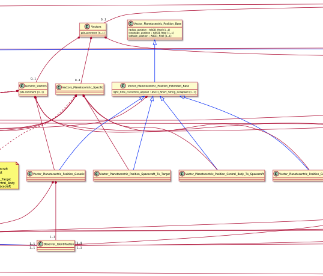

## Why Visualize LDDs

* LDDs can be large and difficult to navigate
    * This makes them more difficult to understand
    * It can also make it more difficult to spot errors
* Generating visual representations of the LDD can make it easier to understand
* These representations can also be re-used in documentation
    
## IngestLDDView

* A series of XSLT files that will convert an LDD to various formats
* These XSLT also have accompanying scripts to perform the conversion

## IngestLDDView - UML mode 0

## IngestLDDView - UML mode 1

* Each class is drawn in a box, with the class name as a header
* Attributes that belong to that class are placed lower in the box

## IngestLDDView - UML mode 2

* Classes are connected with arrows
    * This illustrates how classes releate to each other

## IngestLDDView - UML mode 3

* Different arrows for inheritance and composition/aggregation

## IngestLDDView - Graphviz mode 0

## IngestLDDView - Graphviz mode 1

* Each class is drawn in a box

## IngestLDDView - Graphviz mode 2

* Each attribute is drawn in an oval

## IngestLDDView - Graphviz mode 3

* Classes and attributes are connectected by arrows
    * Unlike UML mode, This an illustrate how attributes are reused

## IngestLDDView - Graphviz mode 4

* Each schematron rule is drawn in a diamond

## IngestLDDView - HTML Mode

* Each class is described in an html fieldset
* This could be used as a starting point for documetation, but it should not be the only source of documenation, since it just repeats the information in the LDD.

## LD3 - 1

* LD3 is a visualization and design tool for data dictionaries

## LD3 - 2

* The tool is web-based, and also incorporates some of the functionality of IngestLDDView
* This is just a prototype, but can be useful in some situations.

